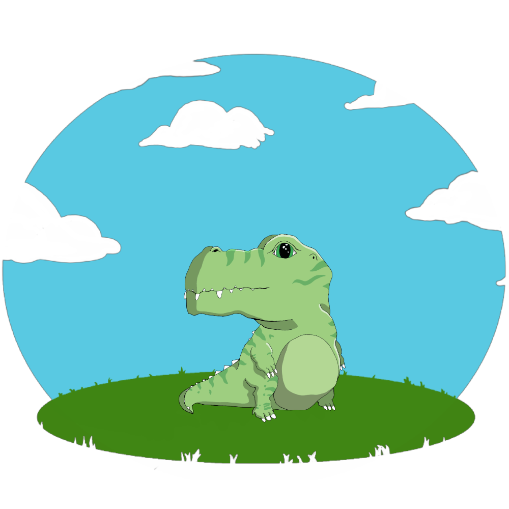
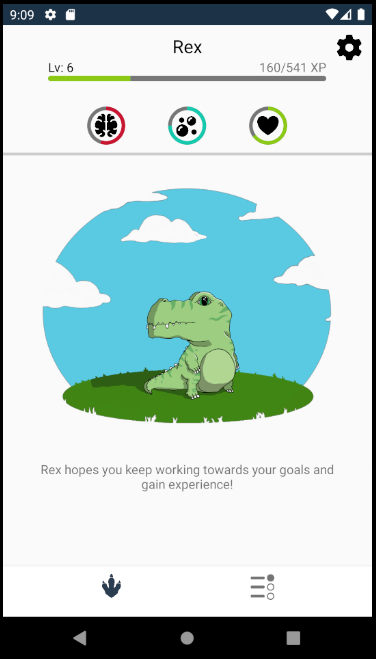
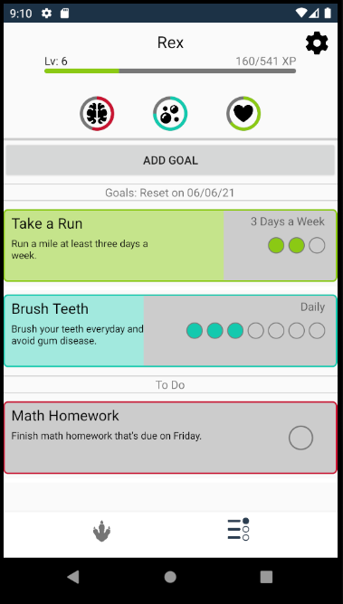
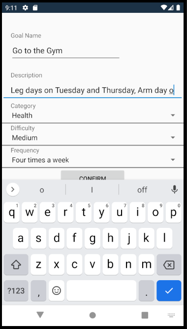

Prodipal is a mobile application for Android that incentivizes productivity by utilizing a gamified approach. Prodipal was created by a team of four at Seattle Pacific University. Prodipal allows the user to create goals and to-do list tasks which enables one to keep track of their priorities to increase a more productive and beneficial lifestyle. To provide additional incentive, Prodipal tracks your progress through the form of an in-app pet. The user's pet will increase in levels with every completion of a goal or to-do list task. The pet evolves into larger versions of itself as the pet progresses through levels. To see the application in more detail, a link to Prodipal's official YouTube channel will be linked below, which consists of demos showcasing the best of what our app has to offer!

[Download Prodipal Now!](https://play.google.com/store/apps/details?id=com.companyname.prodipal)
 

[Official Prodipal YouTube Channel](https://www.youtube.com/channel/UCu8a0IzsSQMkkcElXZtoG-Q)

---

<h2 align="center"><u>Screenshots of Prodipal</u></h2>

    

    

    

    

    

    

